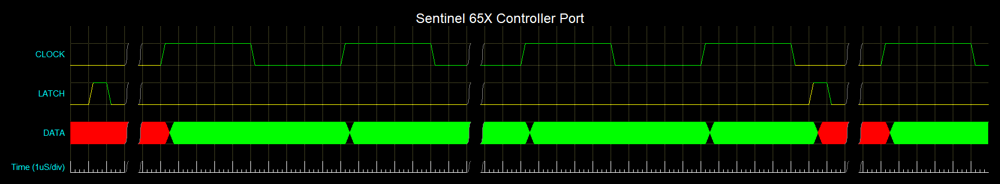

# Sentinel 65X Controller Port Protocol

## Physical Connection

The Sentinel 65X uses a Super Nintendo Entertainment System (SNES) controller port, as used on the Super Nintendo Entertainment System(R) and Super Famicom(R) home entertainment systems. Socket connectors are generally available for purchase from specialist retro console repair suppliers, or AliExpress et al. Plug connectors are almost always available only as part of a cable assembly from the same suppliers as sockets - if you happen to find a reliable source of PCB-mount SNES plugs, please let us know!

## Electrical Signals

All electrical signals on the controller ports are similar to the SNES signals. The Sentinel 65X exclusively uses 3.3V CMOS logic levels, and contains signal voltage level shifters based on the popular [MOSFET level shifter](https://www.digikey.com/en/blog/logic-level-shifting-basics) design. Due to the level shifter, high-speed signals above 1MHz may not have adequate rise and fall times to swing the full 5V before the next state transition. The Sentinel 65X also provides a 5V power supply to the controller port.

Pins 5 and 6 (Data2 and IOBit) are not connected, as it is very uncommon to find controller plug cable assemblies with these wires. Details of the controller port pinout can be found at <https://wiki.superfamicom.org/schematics-ports-and-pinouts>

## Controller Port Wire Protocol

The controller port wire protocol of the Sentinel 65X is very similar to the SNES controller protocol (ref: <https://gamesx.com/controldata/snesdat.htm>)

### Clock

* **TO-DO:** Verify that a 100kHz clock will work with an ATMEGA328-based Arduino as a typical "slow" controller port device

To support slow or complex controller port devices, clock rate is limited to a maximum of 100kHz. At least 16 clock cycles of low-to-high-to-low will be sent at the clock frequency after each `LATCH` 

**Rising Edge:** Signal for the controller port device to process and latch-out the next data bit to the `DATA` lines from the controller port device's Controller Port State Register.

**High:** The controller port device processes and latches next data bit from its Controller Port State Register to the `DATA` line. Once the `DATA` line is stable, the controller port device can continue processing. Sentinel 65X may process any application code during this time.

**Falling Edge:** The controller port device must keep its `DATA` line stable until next rising edge. Signal to Sentinel 65X to sample the `DATA0` and `DATA1` lines.

**Low:** Sentinel 65X samples the `DATA0` and `DATA1` lines and shifts in the logic level into the Controller Port State Registers. After all data bits are received, the Sentinel 65X will pulse the `LATCH` line high as soon as possible after the `CLOCK` falling edge. Once the `DATA0` and `DATA1` lines are sampled and processed, the Sentinel 65X may continue processing application code.

### Latch

* **TO-DO:** Verify that a 1uS latch pulse will work through the level shifter

**Rising Edge:** Signal for the controller port device to start loading the output into the controller port device's Controller Port State Register. The rising edge of `LATCH` will be sent by the Sentinel 65X as soon as possible after the falling edge of `CLOCK` to give the controller port device as much time as possible to load the next data bits into the controller port device's Controller Port State Register.

**High:** The controller port device loads the next data bits into its Controller Port State Register. `LATCH` will be held high by the Sentinel 65X for a minimum of 1uS.

**Falling Edge:** The controller port device can continue to load the next data bits into its Controller Port State Register, or process data bits, until the next rising edge of `CLOCK` or `LATCH`.

**Low:** The controller port device can continue to load the next data bits into its Controller Port State Register, or process data bits, until the next rising edge of `CLOCK` or `LATCH`.

### Data

* **TO-DO:** Verify logic-high and logic-low maps to 0 and 1 respectively, <https://www.nesdev.org/wiki/Controller_port_pinout> suggests they are inverted: `The signal read by the CPU is logically inverted from the signal input on the D0-4 lines. A low voltage on D0 will be read as a 1 bit from $4016/4017.`

The `DATA0` and `DATA1` lines are 3.3V CMOS logic level after applying level shifting. When the Sentinel 65X samples the `DATA0` and `DATA1` lines after the falling edge of `CLOCK`, logic high will be interpreted as a 0 bit, logic low will be interpreted as a 1 bit.

### Waveform view

## Controller Port State Registers

### Register Map

|Bit|\(N * 8) + \[15:8]|\(N * 8) +\[7:4]|\(N * 8) +\[3:0]|N * 8|
|-|-|-|-|-|
|**Description**|Data MSB|Data LSB|Signature|Extra Data|

### Data - \(N * 8) + \[15:4]

The first byte and high 4 bits of the second byte contains data significant to the device connected.

### Signature - \(N * 8) + \[3:0]

The low 4 bits of the second byte contains the device signature, which identifies the type of device connected which in turn identifies how many bits of data must be received and how to process the data. Controller port peripherals currently supported by the Sentinel 65X are listed in the following table:

|Signature Bits|Peripheral|Notes|
|-|-|-|
|0b0000|[SNES Controller](https://www.nesdev.org/wiki/SNES_controller)||
|0b0001|[SNES Mouse](https://www.nesdev.org/wiki/Super_NES_Mouse)|16 bits extra data|
|0b0010|[Sentinel 65X Keyboard](sentinel-65x-keyboard-protocol.md)|Scan codes|
|0b1111|[Controller port device fault](#device-fault-codes)||

## Device Fault Codes

Dedicated Sentinel 65X controller port devices should support the following extended device fault codes.

|Bit|\[15:8]|\[7:4]|\[3:0]|
|-|-|-|-|
|**Description**|Controller Extended Fault Code|0b0000|0b1111|
||Mouse Extended Fault Code|0b0001|0b1111|
||[Keyboard Extended Fault Code](sentinel-65x-keyboard-protocol.md#keyboard-fault-codes)|0b0010|0b1111|
||[Generic Extended Fault Code](#generic-extended-fault-codes)|0b1111|0b1111|

## Generic Extended Fault Codes

Where a more specific fault code is not available, a controller port device may use the following generic device fault codes.

|Code|Description|
|-|-|
|0x01|Device input transient error.|
|0x02|Device output transient error.|
|0x03|Device processing transient error.|
|0xFD|Device runtime failure. Controller port device can't continue processing, and is no longer usable. Device will likely recover if power cycled. This fault code repeats indefinitely until the controller port device is power cycled.|
|0xFE|Device POST error. Controller port device has failed its power-on self-test, and is not usable. Device may recover if power cycled. This fault code repeats indefinitely until the controller port device is power cycled.|
|0xFF|Controller port device may have underflowed its controller port state register, or has otherwise failed in a way that has latched `DATA` electrically low.|

## Sentinel 65X controller port read algorithm

1. Drive `LATCH` high for 1us
1. Zero controller port state registers
1. Set bit counter to `0`
1. Start a 100kHz clock that drives the `CLOCK` line, starting logic-low
1. Wait for falling edge on `CLOCK` line
1. Sample `DATA0` and `DATA1` lines - logic high translates to a 0 bit, logic low translates to a 1 bit.
1. Controller Port State Registers `|=` `DATA0` and `DATA1` lines logic level
1. Increment bit counter
1. When bit counter `==` `16`, check low 4 LSBs of the Controller Port State Registers to determine type of device connected to controller port
1. If device type requires more than 16 bits of data to be read, repeat steps 5 to 8 until all data is read
1. When all data is read, copy controller port state registers to memory
1. Repeat steps 1 to 3
1. Stop the clock and process the memory copy of the controller port state registers (i.e. draw the rest of the owl)
1. Continue from step 4

## Acknowledgements

Nintendo, Super Nintendo Entertainment System and Super Famicom are registered trade marks of Nintendo Co., Ltd. (任天堂株式会社) in Japan and/or other countries.
